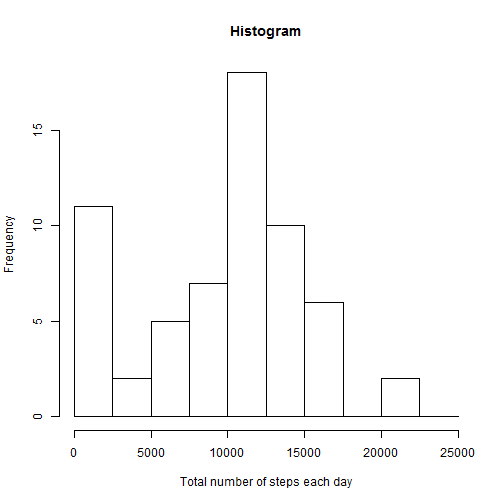
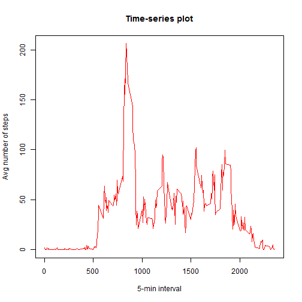
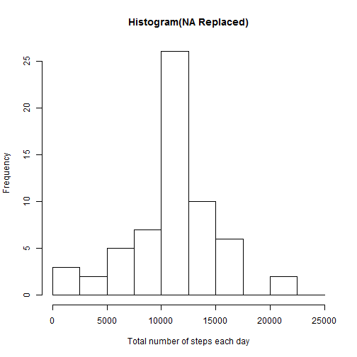
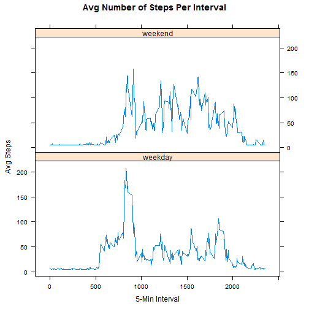

## Introduction
<br>

This is a Peer Assessment Project for Coursera <Reproducible Research> Class

<br><br>

## Loading and preprocessing the data
<br>

Load the given dataset 'activity.csv' with header and assign to 'data'.<br>
There are three variables (steps, date, inverval) in the given dataset.<br>
Let's check the dataset by using str(data) and head(data)<br>


```r
data <- read.csv('activity.csv', header=T)
str(data)
```

```
## 'data.frame':	17568 obs. of  3 variables:
##  $ steps   : int  NA NA NA NA NA NA NA NA NA NA ...
##  $ date    : Factor w/ 61 levels "2012-10-01","2012-10-02",..: 1 1 1 1 1 1 1 1 1 1 ...
##  $ interval: int  0 5 10 15 20 25 30 35 40 45 ...
```

```r
head(data)
```

```
##   steps       date interval
## 1    NA 2012-10-01        0
## 2    NA 2012-10-01        5
## 3    NA 2012-10-01       10
## 4    NA 2012-10-01       15
## 5    NA 2012-10-01       20
## 6    NA 2012-10-01       25
```

The date data needs to be converted.<br>
Let's use this code to change the class of the value.


```r
data$date <- as.Date(data$date)
str(data)
```

```
## 'data.frame':	17568 obs. of  3 variables:
##  $ steps   : int  NA NA NA NA NA NA NA NA NA NA ...
##  $ date    : Date, format: "2012-10-01" "2012-10-01" ...
##  $ interval: int  0 5 10 15 20 25 30 35 40 45 ...
```

## Histogram, Mean & Median
<br>

We will use hist function to draw the basic histogram.<br>
Then, calculate mean and median of totalsteps with ease.<br>
Remember, we must check na.rm = T option to calculate sums.<br>


```r
sum.steps <- aggregate(data$steps, by=list(data$date), FUN=sum, na.rm=T)
names(sum.steps) <- c("date", "sum")
hist(sum.steps$sum, breaks=seq(from=0, to=25000, by=2500),
     xlab="Total number of steps each day", main="Histogram")                  
```

 

```r
mean(sum.steps$sum, na.rm=T)
```

```
## [1] 9354.23
```

```r
median(sum.steps$sum, na.rm=T)
```

```
## [1] 10395
```

<br><br>

## Average daily activity pattern
<br>

First, let's create avg.steps by using aggregte function.<br>
Name the attributes and draw the plot by baseplot system.<br>
Remember, there was a hint that directs us to use type="l".<br>


```r
avg.steps <- aggregate(x=data$steps, by=list(data$interval), FUN=mean, na.rm=T)
names(avg.steps) <- c("interval", "avg")
plot(avg.steps$interval, avg.steps$avg, type="l", lwd=1, col="red",
     xlab="5-min interval", ylab="Avg number of steps", main="Time-series plot")
```

 

<br><br>

How can we figure out which interval contains the maximum number of steps?<br>
From the graph, we can assume that the interval will be somewhere around 850.<br>


```r
max(avg.steps$avg)
```

```
## [1] 206.1698
```

```r
avg.steps[which(avg.steps$avg == max(avg.steps$avg)), ]
```

```
##     interval      avg
## 104      835 206.1698
```

After get 206.xx from the max function, the easiest approach is to<br>
look for the maximum 206.xx value from the avg.steps dataset itself.<br>
However, I used which(... == ... ) instead. <br>

<br><br>

## Missing Values
<br>

Just counting missing values is simple.


```r
sum(is.na(data$steps))
```

```
## [1] 2304
```

The number of NA value is 2304. How can we control these missing values?<br>
Should we ignore them? or replace them with mean or median value of that day?<br>
Let's create a new dataset that has no missing values, replaced by mean values.<br>


```r
na <- which(is.na(data$steps))
avg <- rep(mean(data$steps, na.rm=T))
avg <- round(avg)
data[na, "steps"] <- avg
sum(is.na(data$steps))
```

```
## [1] 0
```

Then, draw a histogram. Following codes are same as previous ones.<br>


```r
sum.steps2 <- aggregate(data$steps, by=list(data$date), FUN=sum, na.rm=T)
names(sum.steps2) <- c("date", "sum")
hist(sum.steps2$sum, breaks=seq(from=0, to=25000, by=2500),
     xlab="Total number of steps each day", main="Histogram(NA Replaced)")   
```

 

```r
mean(sum.steps2$sum, na.rm=T)
```

```
## [1] 10751.74
```

```r
median(sum.steps2$sum, na.rm=T)
```

```
## [1] 10656
```

The overall trend has not changed, however, there are obvious chagnes.<br>

<br><br>

## Weekdays & Weekends
<br>

To compare weekdays and weekends data, we need to create a new attribute.<br>
We can use weekdays function to command this.<br>
At the first sight, the attribute has six levels.<br>
So, We should convert them into two levels(weekday, weekend).<br>


```r
data$weekdays <- factor(weekdays(data$date))
levels(data$weekdays)
```

```
## [1] "금요일" "목요일" "수요일" "월요일" "일요일" "토요일" "화요일"
```

```r
levels(data$weekdays) <- c("weekday", "weekday", "weekday", "weekday", "weekend", "weekend", "weekday")
levels(data$weekdays)
```

```
## [1] "weekday" "weekend"
```

Now It's time to draw the plot comparing two day types.<br>
Before that, let's convert the previous data into a new one.<br>
Also, we must bring up lattice package to use xyplot system.<br>


```r
newdata <- aggregate(data$steps, by=list(data$weekdays,  data$interval), mean)
names(newdata) <- c("daytype", "interval", "avgsteps")
library("lattice")
xyplot(avgsteps ~ interval | daytype, newdata, type = "l",
       layout = c(1,2), xlab="5-Min Interval",
       ylab="Avg Steps", main="Avg Number of Steps Per Interval")
```

 

<br><br>
